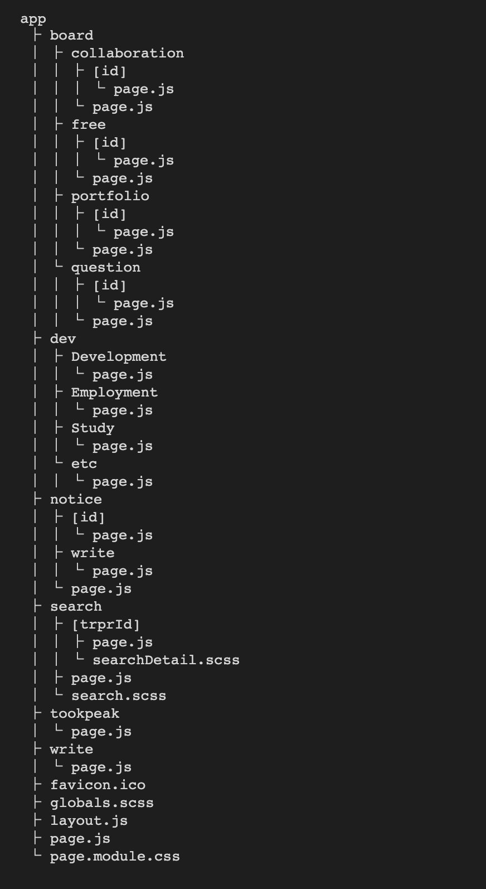

# ⛰TOOK-PEAK

국비지원 교육 과정으로 프로그래밍 수업을 듣는 학생들을 위한 커뮤니티
 
 

## 🖥️ 프로젝트 소개

-   국비지원 교육을 듣는 학생들이 다른 교육기관의 학생들과 교류를 통해 다양한 정보를 얻을 수 있도록 커뮤니티 사이트를 제작하였습니다.
-   취업, 아이디어, 기술 등 양질의 정보를 서로 공유하고, 같은 뜻을 가지고 있는 사람과 함께 협업을 할 수 있으며, 선의의 비교를 통해 개발자에 대한 동기부여를 얻을 수 있도록 프로젝트를 만들었습니다.
-   이 프로젝트를 통해 학생들이 정보를 공유하고 협업을 통해 성장할 수 있도록 하였습니다.

 

## 🕰️ 개발 기간

-   23.08.19 - 23.09.06 (19일)
     

## ⚙️ 개발 환경

-   `Next.js 13.2.4`
-   `React 18.2.0`
-   `SCSS 1.66.1`
-   `IDE : VScode 1.80`
-   `ETC : Github / Window, Mac OS 환경에서 개발`
-   `DEPLOY : vercel`
     

## 💾 Package

-   **@next-auth/mongodb-adapter**: 인증 및 세션 관리를 위한 MongoDB 어댑터.

-   **aws-sdk(2.1440.0)**: Amazon Web Services (AWS)와 상호 작용하기 위한 SDK.

-   **bcrypt(5.1.1)**: 암호화 및 해시 기능을 제공하는 패키지.

-   **mongodb(5.8.0)**: MongoDB 데이터베이스와 상호 작용하기 위한 드라이버.

-   **next-auth(4.23.1)**: 인증 및 세션 관리를 위한 패키지.

-   **react-bootstrap(2.8.0)**: 부트스트랩과 리액트를 통합하는 패키지.

-   **react-datepicker(4.16.0)**: 날짜 선택을 위한 리액트 컴포넌트.

-   **react-icons(4.10.1)**: 아이콘 라이브러리.

-   **react-js-pagination(3.0.3)**: 페이지네이션을 위한 리액트 컴포넌트.

-   **zustand(4.4.1)**: 상태 관리 라이브러리.
     

## 📁 폴더 구조

<!--  -->

## 💻 Release History

-   1.0.2 (23.09.08)
    -   기타 버그 수정
-   1.0.1 (23.09.07)
    -   UI 및 기타 버그 수정
-   1.0.0 (23.09.06) \* first release
     

## 📌 주요 기능

#### 회원

-   정규 표현식을 사용하여 회원가입 기능 구현
    -   회원가입은 간단하고 안전하게 구현되었습니다.
    -   정규 표현식을 활용하여 사용자가 올바른 정보를 입력할 수 있도록 보장합니다.
-   next-auth를 사용하여 로그인, 로그아웃 기능 구현
    -   강력한 인증 및 세션 관리를 위해 next-auth를 도입했습니다.
    -   사용자는 쉽게 로그인하고 로그아웃할 수 있으며, 보안과 편의성을 동시에 제공합니다.

#### 국비 교육과정 검색

-   훈련과정 상세정보 출력
    -   HRD-Net의 오픈 API를 통해 국비 교육과정 정보를 가져와 사용자에게 제공합니다.
-   훈련과정 후기 작성
    -   각 교육과정의 상세 정보 페이지에서 사용자들은 훈련 후기를 작성하고 공유할 수 있습니다.
    -   이를 통해 다른 사용자들은 실제 경험을 공유하고 교육과정을 선택하는 데 도움을 받을 수 있습니다.

#### 게시판

-   게시판 선택 후 글 작성
    -   편리한 글 작성을 위해 하나의 페이지에서 다양한 카테고리를 선택할 수 있습니다.
    -   사용자는 원하는 게시판에 글을 작성하고 공유할 수 있습니다.
-   사진을 첨부하여 글 작성
    -   사용자는 시각적으로 내용을 보충하고 공유할 수 있습니다.
-   글쓴이, 작성일자, 조회수 확인
    -   모든 게시물에는 글쓴이, 작성일자 및 조회수 정보가 제공됩니다.
    -   이를 통해 게시물의 신뢰성을 높이고 사용자간의 상호작용을 촉진합니다.
-   게시글에 대한 댓글 작성
    -   사용자들은 게시글에 댓글을 작성하여 의견을 공유하고 토론할 수 있습니다.
    -   이를 통해 커뮤니티의 활발한 상호작용을 지원합니다.

#### 개발에 도움되는 정보

-   개발, 공부, 취업, 기타 4개의 카테고리로 분류
    -   다양한 정보를 구분하기 위해 네 가지 주요 카테고리로 정보가 분류됩니다.
    -   각 카테고리는 해당 주제에 관한 유용한 정보를 제공합니다.

 

## ➕ 추가할 기능

#### 우선순위(1)

-   글 수정
-   글 삭제
-   비밀번호 찾기
-   좋아요 기능

#### 우선순위(2)

-   다크모드
-   프로필 수정
-   인기 있는 게시글
     

## ➖ 수정사항

-   검색 엔터 키 지원
-   vercel 배포 시 게시글 업로드 시간 개선
